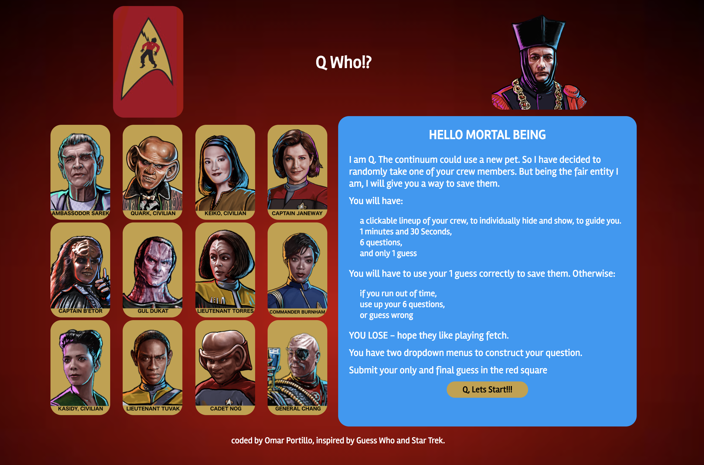

# Q Who

<figure>
  
  <figcaption><a href="#" title="Q Who!?">This is my first project at GA: it inspired by the classic game Guess with a Star Trek theme.</a>.</figcaption>
</figure>

### Installation and setup

#### Run Locally
- Download or clone the [Github repo](https://github.com/omrprt/wdi-first-project)
- Run `gulp` in the terminal to compile the source code and open in the browser

#### View Online

- [View on Heroku](https;//#.herokuapp.com)
- [View on Github](https://github.com/omrprt/wdi-first-project)

### Technologies used

To create this project I used the following technologies:

- HTML5
- SCSS
- Javascript (ECMAScript 6)
- jQuery
- Git
- Github
- Heroku
- Atom
- GIMP

### Challenges Faced

-Drying up the code
-Randomizing the object array and choosing only twelve items from the array.
-Styling with flexbox and completely understanding how it was working.

### Where next?

How can the game be extended and improved:

- adding difficulty levels:
  *Right now it only has one setting

- making the layout more responsive:
  *Currently the pictures do not line up nicely when the screen is smaller.

- restart to the play area:
  *Currently it restarts by reloading the page and the user has to see the rules again.

- Improving the code:
  *I am certain that there are areas of my code to be more efficient and dryer.
  *the code could be possibly refactored further.

## Acknowledgments

* Hat tip to anyone who's code was used
* Inspiration
* etc
