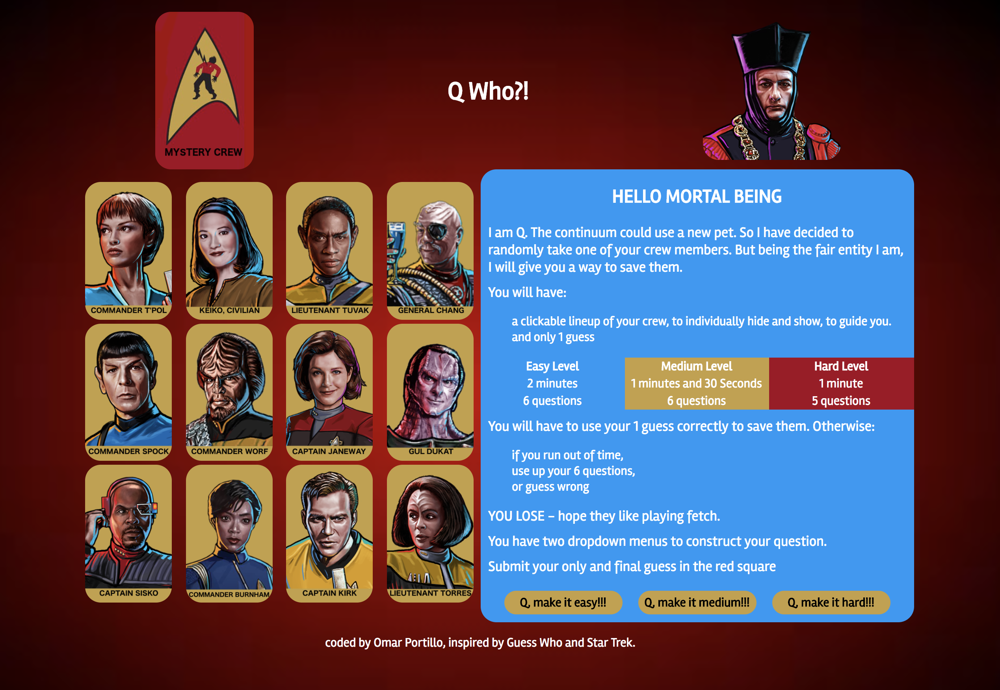
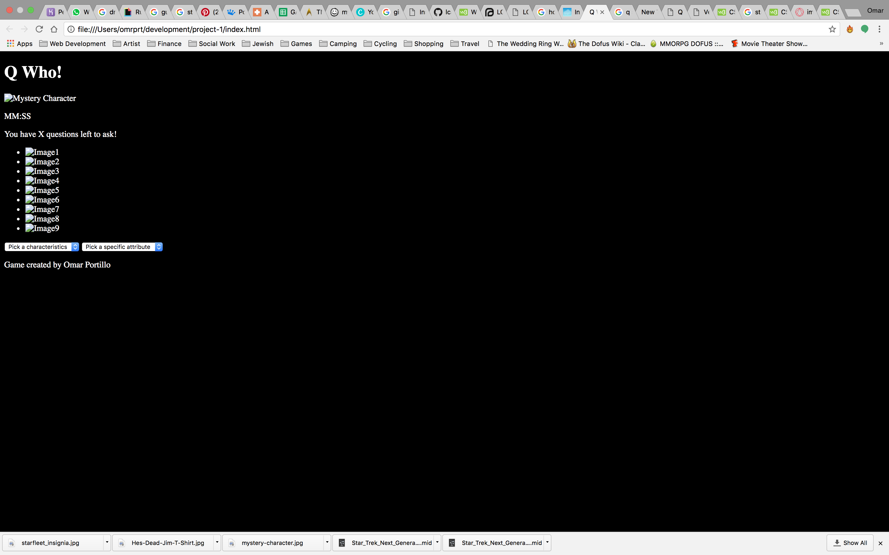
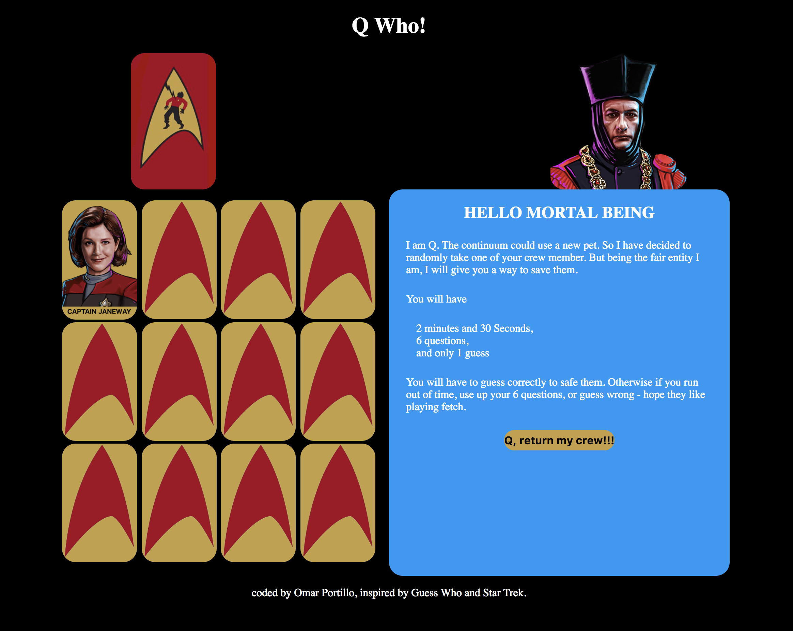

# Q Who

<figure>
  
  <figcaption><a href="#" title="Q Who!?">This is my first project at GA: it inspired by the classic game Guess with a Star Trek theme.</a></figcaption>
</figure>

### Project Brief

Your app must:

Your app must:

* Render a game in the browser
* Design logic for winning & visually display which player won
* Include separate HTML / CSS / JavaScript files
* Stick with KISS (Keep It Simple Stupid) and DRY (Don't Repeat Yourself) principles
* Use Javascript or jQuery for DOM manipulation
* Deploy your game online, where the rest of the world can access it
* Use semantic markup for HTML and CSS (adhere to best practices)

### Installation and setup

#### Run Locally
- Download or clone the [Github repo](https://github.com/omrprt/wdi-first-project)
- Run `gulp` in the terminal to compile the source code and open in the browser

#### View Online

- [View on Heroku](https://qwho.herokuapp.com/)
- [View on Github](https://github.com/omrprt/wdi-first-project)

### Approach Taken

1. I started with a very short brain storming session of games and things I like.
2. Worked on the wireframe.
3. Worked on the CSS.
4. Worked on the JavaScript.
5. Had UX feedback.
6. Worked on making it responsive.
7. looped again and again.

<figure>
  
  <figcaption>Initial HTML CODE.</a></figcaption>
</figure>

### Technologies used

To create this project I used the following technologies:

- HTML5
- SCSS
- Javascript (ECMAScript 6)
- jQuery
- Git
- Github
- Heroku
- Atom
- GIMP

### Challenges Faced

-Drying up the code
-Randomizing the object array and choosing only twelve items from the array.
-Styling with flexbox and completely understanding how it was working.
-Difficulty adding sound.

<figure>
  
  <figcaption>Midpoint progress.</figcaption>
</figure>

### Where next?

How can the game be extended and improved:

- making the layout more responsive:
 * Currently the pictures do not line up nicely when the screen is smaller.

- restart to the play area:
  * Currently it restarts by reloading the page and the user has to see the rules again.

- add audio:
    * attempted to add audio but could not implement - This has been resolved.

- Improving the code:
  * I am certain that there are areas of my code to be more efficient and dryer.
  * the code could be possibly refactored further.

## Acknowledgments
* Would like to thank my instructors at GA, and classmates.
* It was inspired by Guess Who and Star Trek.
* Thanks to Robert, Brian and Josh for their feedback.
* Character images were taken from the Star Trek Timeline wiki.
* Star Trek is a copyright of CBS Studios Inc.
